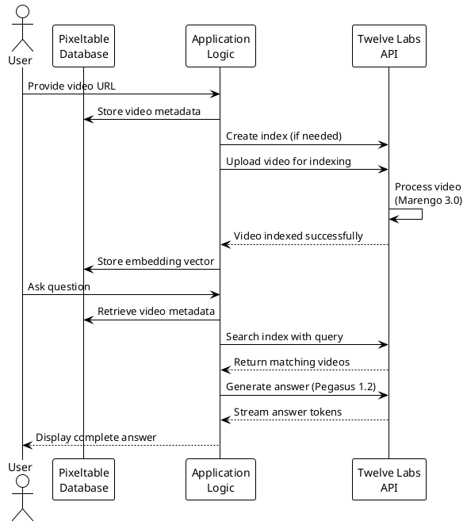
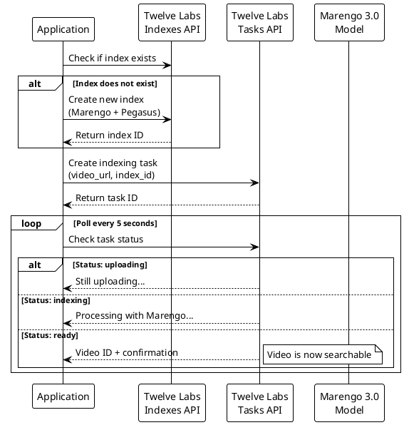
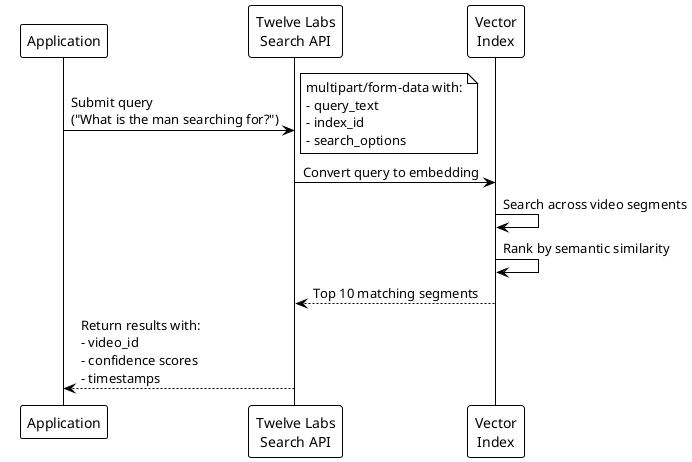
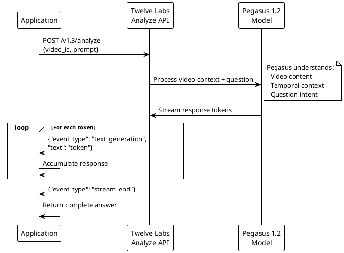

# Video Question Answering with Twelve Labs and Pixeltable

A demonstration application that enables natural language question answering over video content by combining Twelve Labs' multimodal AI with Pixeltable's vector database capabilities.

## Overview

This project showcases how to build an intelligent video understanding system that can:
- Index video content with state-of-the-art multimodal AI models
- Search through videos using natural language queries
- Generate contextual answers to questions about video content

The system uses **Twelve Labs' Marengo 3.0** for video understanding, **Pegasus 1.2** for question answering, and **Pixeltable** for data orchestration and storage.

## What Does This Application Do?

In simple terms, this application allows you to:

1. **Upload a video** - Provide a URL to any video file
2. **Ask questions** - Query the video using natural language (e.g., "What is the man searching for?")
3. **Get intelligent answers** - Receive contextual, AI-generated responses based on the video's visual and audio content

For example, given a clip from "The Pursuit of Happyness", the system can understand that Chris Gardner is searching for an opportunity and provide detailed context about his journey.

## How It Works

### High-Level Architecture


### Technical Flow

The application operates in three distinct phases:

#### Phase 1: Video Indexing

When a video is added to the system:


The Marengo 3.0 model analyses:
- **Visual content** - Objects, scenes, actions, faces
- **Audio content** - Speech, dialogue, sound effects
- **Text** - On-screen text, captions

#### Phase 2: Semantic Search

When searching for relevant content:


The search operates across multiple modalities:
- **visual** - Visual scene matching
- **transcription** - Spoken word matching
- **audio** - Audio pattern matching (if enabled)

#### Phase 3: Answer Generation

When generating an answer:


The Pegasus model generates answers by:
1. Understanding the visual and audio context from the video
2. Reasoning about the question's intent
3. Synthesising a coherent, contextual response
4. Streaming the answer token-by-token for responsiveness

## System Components

### 1. Pixeltable Integration

**Pixeltable** serves as the orchestration layer, managing:
- Video metadata storage
- Computed columns that trigger indexing
- Embedding vectors for potential hybrid search
```python
# Create a table with video metadata
videos = pxt.create_table(f'{PROJECT_NAME}.index', {
    'video': pxt.Video,
    'url': pxt.String
})

# Add a computed column that triggers Twelve Labs indexing
videos.add_computed_column(embedding=index_and_embed(videos.url))
```

### 2. Twelve Labs API Integration

The application interfaces with three primary Twelve Labs endpoints:

#### Indexes API (`/v1.3/indexes`)
- **Purpose**: Manage video indexes
- **Format**: JSON
- **Authentication**: x-api-key header

#### Tasks API (`/v1.3/tasks`)
- **Purpose**: Upload and index videos
- **Format**: multipart/form-data
- **Parameters**: `index_id`, `video_url`, `language`

#### Search API (`/v1.3/search`)
- **Purpose**: Semantic video search
- **Format**: multipart/form-data
- **Parameters**: `query_text`, `index_id`, `search_options[]`

#### Analyze API (`/v1.3/analyze`)
- **Purpose**: Generate answers about videos
- **Format**: JSON request, streaming JSON response
- **Parameters**: `video_id`, `prompt`

### 3. Custom UDFs (User-Defined Functions)

The application defines several UDFs for Pixeltable:

**`index_and_embed(video_url)`**
- Uploads video to Twelve Labs
- Polls for indexing completion
- Returns a placeholder embedding vector

**`text_embed(text)`**
- Creates placeholder embeddings for text queries
- Required by Pixeltable's embedding index interface

**`generate_answer(query_text)`**
- Searches the Twelve Labs index
- Retrieves the most relevant video
- Generates a contextual answer using Pegasus

## Setup Instructions

### Prerequisites

- Python 3.9 or higher
- Twelve Labs API key ([obtain here](https://playground.twelvelabs.io/))
- Basic understanding of virtual environments

### Installation

1. **Clone the repository**
```bash
git clone https://github.com/yourusername/video-qa-twelvelabs
cd video-qa-twelvelabs
```

2. **Create a virtual environment**
```bash
python3 -m venv venv
source venv/bin/activate  # On Windows: venv\Scripts\activate
```

3. **Install dependencies**
```bash
pip install pixeltable requests numpy
```

4. **Configure your API key**

Edit `my_functions.py` and replace the API key:
```python
API_KEY = "your_api_key_here"
```

5. **Run the application**
```bash
python3 main.py
```

### Expected Output
```
🚀 Starting dokumenta_video...
🧠 Adding embedding column...
🎥 Processing Video: https://...
   ↳ Task ID: 698f1ac0... (Waiting for processing...)
   ⏳ Status: uploading (attempt 1/120)
   ⏳ Status: indexing (attempt 2/120)
   ✅ Video Ready! ID: 698f1ac0...
✅ Indexing complete!
🤖 Asking Twelve Labs about: 'What is the man searching for?'
   🔍 Searching in index...
   ✅ Found 10 results
   📝 Generating answer...

========================================
QUESTION: What is the man searching for?
TWELVE LABS ANSWER: The man, Chris Gardner, is searching for...
========================================
```

## Project Structure
```
my_video_app/
├── main.py              # Application entry point
├── my_functions.py      # Twelve Labs integration & UDFs
├── venv/                # Virtual environment (not committed)
└── README.md            # This file
```

### `main.py`

The main application logic:
- Initialises Pixeltable database
- Creates tables and computed columns
- Triggers video indexing
- Executes question answering workflow

### `my_functions.py`

Core integration functions:
- **`get_index_id()`** - Creates or retrieves Twelve Labs index
- **`index_and_embed()`** - UDF for video indexing
- **`text_embed()`** - UDF for query embeddings
- **`search_videos()`** - Semantic search wrapper
- **`generate_answer()`** - Question answering with Pegasus

## Key Implementation Details

### API Format Requirements

One of the significant challenges in integrating with Twelve Labs API v1.3 is the varying content-type requirements:

| Endpoint | Content-Type | Format |
|----------|-------------|---------|
| `/indexes` | `application/json` | Standard JSON |
| `/tasks` | `multipart/form-data` | Form fields |
| `/search` | `multipart/form-data` | Form fields (arrays require multiple fields) |
| `/analyze` | `application/json` | JSON request, streaming response |

#### Handling Multipart Form Data

Python's `requests` library requires specific syntax for multipart/form-data:
```python
# Correct format for multipart/form-data
data = {
    "query_text": (None, "What is happening?"),
    "index_id": (None, index_id),
}

# For array parameters, append multiple times
files_data = list(data.items())
files_data.append(("search_options", (None, "visual")))
files_data.append(("search_options", (None, "transcription")))

resp = requests.post(url, files=files_data, headers=headers)
```

### Streaming Response Parsing

The Analyze endpoint returns a streaming JSON response:
```python
resp = requests.post(url, json=payload, headers=headers, stream=True)

full_answer = ""
for line in resp.iter_lines():
    if line:
        data = json.loads(line.decode('utf-8'))
        if data.get('event_type') == 'text_generation':
            full_answer += data['text']
```

Event types include:
- `stream_start` - Initialisation metadata
- `text_generation` - Answer tokens
- `stream_end` - Completion metadata with usage statistics

### Model Configuration

The application uses two Twelve Labs models:

**Marengo 3.0** (Video Understanding)
- Options: `["visual", "audio"]`
- Purpose: Extract multimodal features from videos
- Use case: Semantic search and content analysis

**Pegasus 1.2** (Question Answering)
- Options: `["visual", "audio"]`
- Purpose: Generate contextual answers
- Use case: Natural language responses about video content

## API Response Examples

### Search Response
```json
{
  "data": [
    {
      "video_id": "698f1a50d88d017e603342f1",
      "score": 0.87,
      "start": 45.2,
      "end": 52.8,
      "confidence": "high"
    }
  ],
  "page_info": {
    "total_results": 10,
    "page": 1
  }
}
```

### Analyze Streaming Response
```json
{"event_type":"stream_start","metadata":{"generation_id":"333e0dbb..."}}
{"event_type":"text_generation","text":"The man, Chris Gardner"}
{"event_type":"text_generation","text":", is searching for an"}
{"event_type":"text_generation","text":" opportunity to join..."}
{"event_type":"stream_end","metadata":{"usage":{"input_tokens":892}}}
```

## Limitations and Considerations

### Rate Limits
- Twelve Labs imposes rate limits on API calls
- Free tier: Check current limits at [docs.twelvelabs.io](https://docs.twelvelabs.io)
- Production: Consider implementing request throttling

### Processing Time
- Video indexing typically takes 15-30 seconds per minute of video
- Complex videos with dense dialogue may take longer
- Plan for asynchronous workflows in production applications

### Cost Optimisation
- Avoid re-indexing videos unnecessarily
- Cache video IDs in your database
- Use batch processing for multiple videos

### Model Limitations
- Search options must match the models configured in your index
- Marengo 3.0 supports: `visual`, `audio`, `transcription`
- Invalid options will result in 400 errors

## Advanced Usage

### Multiple Video Support

To extend the application for multiple videos:
```python
videos_data = [
    {'video': url1, 'url': url1},
    {'video': url2, 'url': url2},
    {'video': url3, 'url': url3}
]
videos.insert(videos_data)
```

### Custom Search Queries

Modify `search_videos()` to accept additional parameters:
```python
def search_videos(query_text, search_options=None, page_limit=10):
    if search_options is None:
        search_options = ["visual", "transcription"]
    
    # Add pagination support
    data = {
        "query_text": (None, query_text),
        "index_id": (None, idx_id),
        "operator": (None, "or"),
        "page_limit": (None, str(page_limit))
    }
    # ...
```

### Timestamp Extraction

Access specific video segments from search results:
```python
search_result = search_videos(query_text)
start_time = search_result.get('start')
end_time = search_result.get('end')
print(f"Answer found at {start_time}s - {end_time}s")
```

## Troubleshooting

### Common Issues

**404 Errors on API Calls**
- Verify you're using API v1.3 (`https://api.twelvelabs.io/v1.3`)
- Check endpoint spelling (e.g., `/analyze` not `/generate`)

**400 "parameter_invalid" Errors**
- Ensure model options match: `["visual", "audio"]` for Marengo 3.0
- Verify search options are valid for your index configuration

**"Content-Type not supported" Errors**
- Use `multipart/form-data` for `/tasks` and `/search`
- Use `application/json` for `/indexes` and `/analyze`
- In requests: use `files=` parameter for multipart, `json=` for JSON

**No Search Results**
- Verify video has finished indexing (check task status)
- Ensure search options match indexed modalities
- Try broader queries initially

**Streaming Parse Errors**
- Confirm you're using `stream=True` in requests
- Check you're handling `text_generation` events specifically
- Verify JSON parsing for each line individually

## Further Development

### Potential Enhancements

1. **Web Interface**
   - Build a Flask/FastAPI frontend
   - Add video upload from local files
   - Display timestamps with answers

2. **Multi-Video Search**
   - Search across entire video libraries
   - Implement result ranking and filtering
   - Add metadata tagging

3. **Real-Time Processing**
   - Webhook integration for indexing completion
   - WebSocket for streaming answers to frontend
   - Progress indicators during indexing

4. **Enhanced Context**
   - Extract and display relevant video frames
   - Show confidence scores for answers
   - Link to specific timestamps

5. **Hybrid Search**
   - Combine Twelve Labs search with Pixeltable vector search
   - Implement custom relevance scoring
   - Add metadata filtering (date, tags, etc.)

## Resources

- [Twelve Labs Documentation](https://docs.twelvelabs.io/)
- [Twelve Labs API Reference](https://docs.twelvelabs.io/api-reference)
- [Pixeltable Documentation](https://docs.pixeltable.com/)
- [Twelve Labs Playground](https://playground.twelvelabs.io/)

## Licence

MIT Licence - See LICENSE file for details

## Contributing

Contributions are welcome! Please feel free to submit a Pull Request.

## Acknowledgements

- Twelve Labs for their powerful multimodal AI API
- Pixeltable for the vector database infrastructure
- The video clip from "The Pursuit of Happyness" used for demonstration

---

**Note**: This is my personal demonstration application (well, more of a prototype). For production use, implement proper error handling, logging, authentication, and rate limiting.
